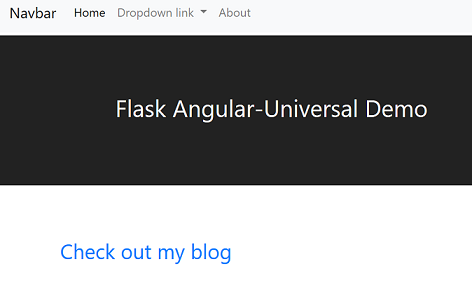

# Flask Angular-Universal Demo
Starter web application project with Angular Universal frontend and Flask RESTapi backend
[ngudemo](http://ngudemo.vectoranalytics.ai)

### Built with components from the following projects

- [Ryan Shea's AngularJS + Flask Boilerplate App](https://github.com/shea256/angular-flask)
- [Angular Universal Starter](https://github.com/angular/universal-starter)
- [Bootstrap Sticky Footer Navbar Template](http://getbootstrap.com/docs/4.0/examples/sticky-footer-navbar/)
- [ng-bootstrap](https://ng-bootstrap.github.io/#/home)

### Requirements
- python 3.6
- Flask
- Flask-SQLAlchemy
- Flask-RESTless
- Node.js 8.x
- npm 5.x
- Angular 6.0.0
- Angular Universal 6.0.0

### Get Started
- Create a virtual environment for python 3.6+ using either [conda](https://conda.io/docs/user-guide/index.html) or [virtualenv](https://virtualenv.pypa.io/en/stable/)
- Install Flask and other requirements per `requirements.txt`
- Install Node.js
- Clone this repo
>git clone --depth 1 https://github.com/lucksd356/Flask-Angular-Universal-Demo.git
- Change to the download directory and run the Flask app
>python runserver.py
- Create and seed the db (the server must still be running, so open a new terminal window first)
>python manage.py create_db && python manage.py seed_db --seedfile ./data/db_items.json

Open a new terminal window, change to the `ngclient` directory and install dependencies:
>npm install

### Development (Client-side only rendering)
* run `npm run start` which will start `ng serve`
- Check out the home page at http://localhost:4200

### Production (also for testing SSR/Pre-rendering locally)
**`npm run build:ssr && npm run serve:ssr`** - Compiles your application and spins up Node Express to serve your Universal application on `http://localhost:4000`.

**`npm run build:prerender && npm run serve:prerender`** - Compiles your application and prerenders your applications files, spinning up a demo http-server so you can view it on `http://localhost:8080`
**Note**: To deploy your static site to a static hosting platform you will have to deploy the `dist/browser` folder, rather than the usual `dist`

## Additional Notes

1. Change the host address for Flask RESTapi:
    - Edit *target* in *proxy.config.json*
    - Edit the proxy address for the *serve:prerender* command in package.json

2. Edit *static.paths.ts* to specify routes for prerendering
